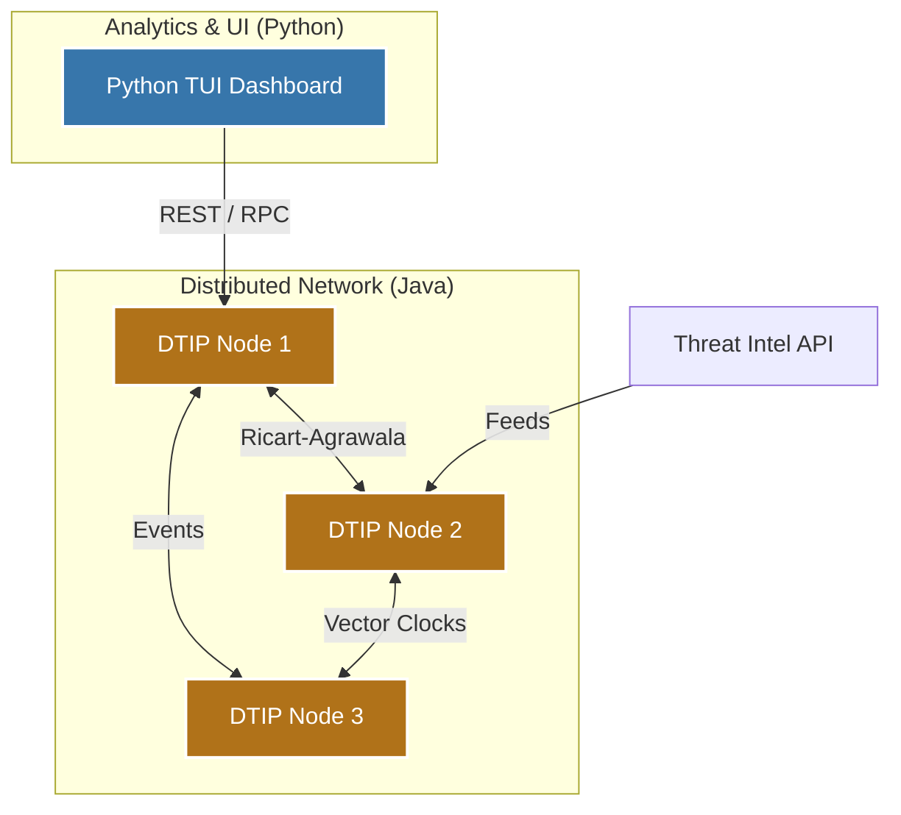

# 🎓 Computer Science Master's Degree Portfolio
**Università di Modena e Reggio Emilia (UNIMORE)**

  

This repository is a curated collection of my most significant projects, theoretical research, and teaching materials developed during my Master's Degree in Computer Science. It showcases my expertise in **Cybersecurity, Distributed Systems, and Autonomous Driving**.

---

## 🚀 Key Highlights

### 🌐 [Distributed Systems & Threat Intelligence](./Distributed-Systems/)
  

*   **Project DTIP (Distributed Threat Intelligence Platform)**: A robust distributed system built in **Java** and **Python** for real-time threat analysis.
    *   **Features**: Implements **Ricart-Agrawala** for mutual exclusion and **Vector Clocks** for event ordering.
    *   **Components**: Includes a custom TUI Dashboard and a modular analyzer engine.
    *   **Theory**: Includes a [comprehensive theoretical summary](./Distributed-Systems/Algoritmi_Distribuiti_Teoria_Completa.pdf) of Distributed Algorithms.

#### 🏗️ System Architecture (DTIP)

### 🚗 [Autonomous Driving Stack](./Autonomous-Driving/)
  

*   **Perception**: Implementation of **Point Cloud Library (PCL)** for 3D filtering, segmentation, and Euclidean clustering.
*   **Control**: Advanced control strategies including **MPC (Model Predictive Control)**, **Stanley Controller**, and **PID** for path tracking in simulated environments.
*   **Localization**: Implementation of **Particle Filters** for vehicle localization.

### 🔐 [Cybersecurity & Cryptography](./Applied-Cryptography/)
*   **Applied Cryptography**: In-depth analysis of modern cryptographic primitives, including RSA, Elliptic Curves, and Digital Signatures.
*   **Data Protection**: A specialized [Regulatory Summary](./Privacy-Data-Protection/riassunto_studio.pdf) and [Normative Table](./Privacy-Data-Protection/tabella_normativa.pdf) on GDPR and Privacy frameworks.

---

## 👨‍🏫 Teaching Experience

### [Teaching Assistant (Tutor Didattico)](./Teaching-Experience/)
*   Supporting the **Informatica Generale** course for the Bachelor's Degree.
*   Developed **11 sets of exercises** and official solutions covering C programming, logic, and computer architecture basics.

---

## 📁 Structure
- `Autonomous-Driving/`: Perception, Control, and Localization assignments.
- `Applied-Cryptography/`: Cryptographic theory and exam preparation.
- `Privacy-Data-Protection/`: GDPR and legal-technical analysis.
- `Distributed-Systems/`: The DTIP project and distributed systems theory.
- `Teaching-Experience/`: Materials from my time as a Teaching Assistant.

---
*Contact me for more details about specific implementation details or academic research.*