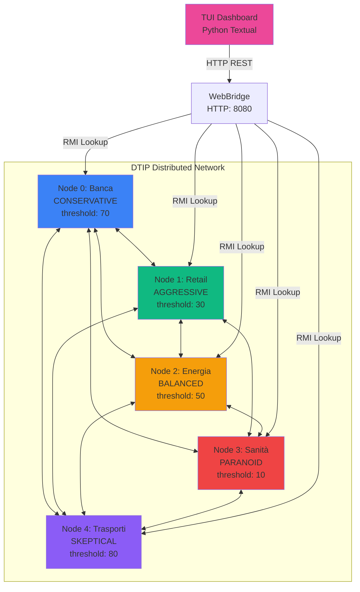
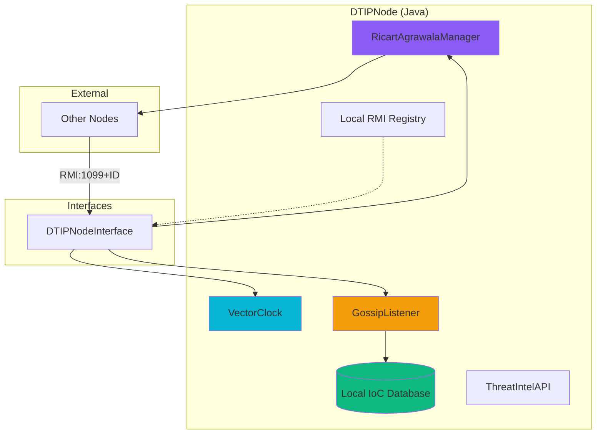
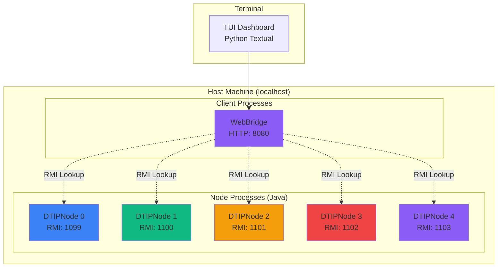

# DTIP Architecture Documentation

**Visual diagrams of system architecture and component interactions**

---

## 1. System Overview

### 1.1 High-Level P2P Network

**Communication Patterns:**
- **P2P RMI:** Nodes communicate directly via Java RMI
- **RMI Callbacks:** Event-driven notifications
- **HTTP REST:** Dashboard fetches state via WebBridge API
- **Fully Connected Mesh:** Each node has direct connection to all others

---

## 2. Component Architecture

### 2.1 Single Node Internal Architecture

**Key Components:**
- **VectorClock:** Tracks causal ordering
- **RicartAgrawalaManager:** Coordinates mutual exclusion (with 5s timeout)
- **Local RMI Registry:** Each node hosts its own registry for autonomy

---

## 6. Deployment Architecture

### 6.1 Process Topology (Single Machine)

**Port Allocation:**
- **RMI Ports:**
  - Node 0: 1099
  - Node 1: 1100
  - Node 2: 1101
  - Node 3: 1102
  - Node 4: 1103
- **WebBridge API:** 8080
- **Sensor Listeners:** 9000-9005

---

*Generated with Mermaid.js*
*Updated: Jan 2026*