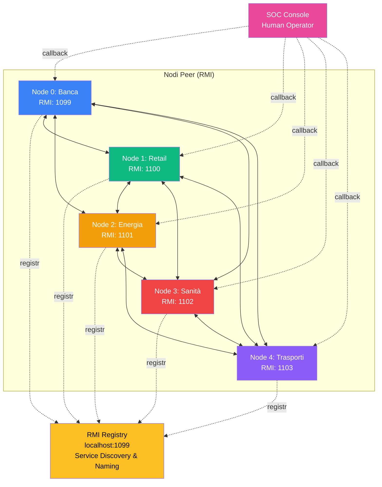
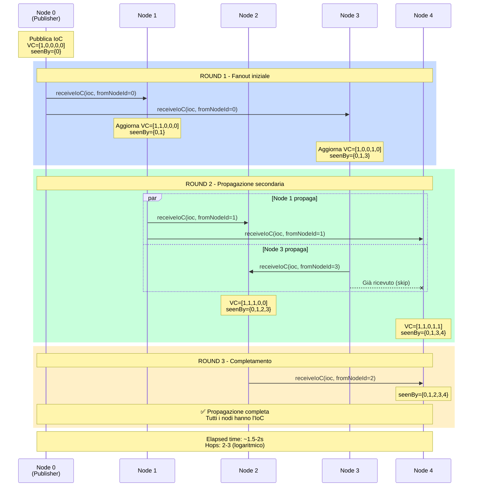
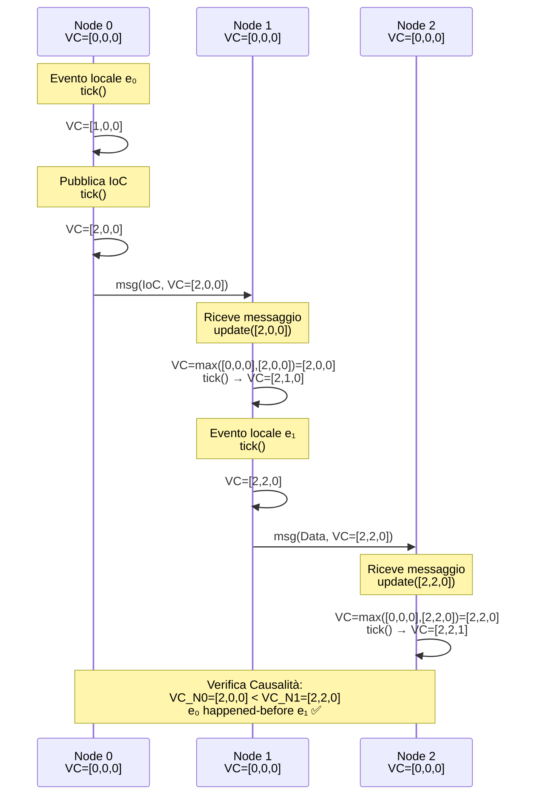
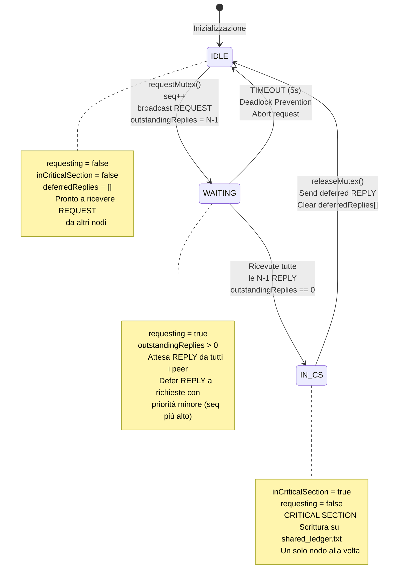
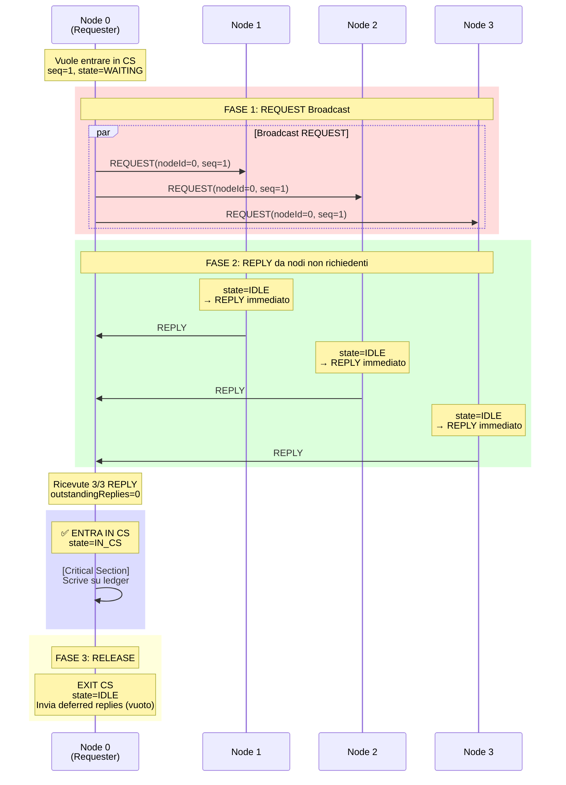
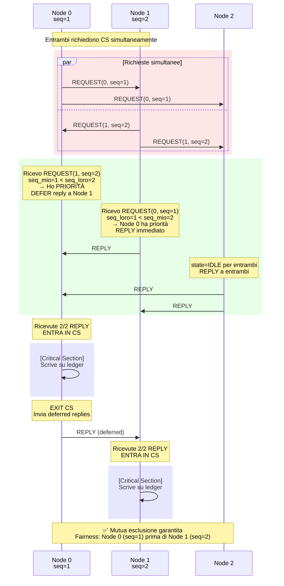
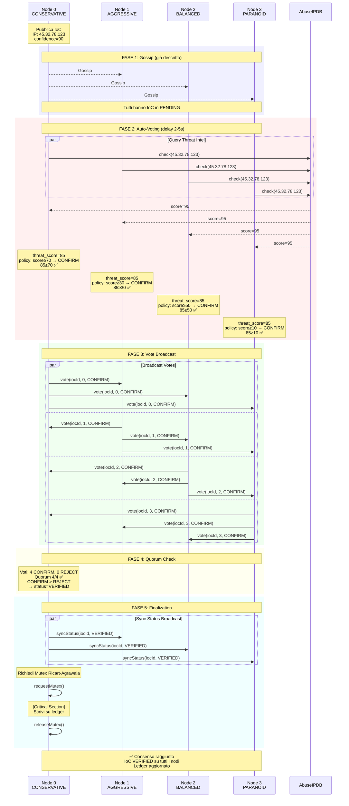
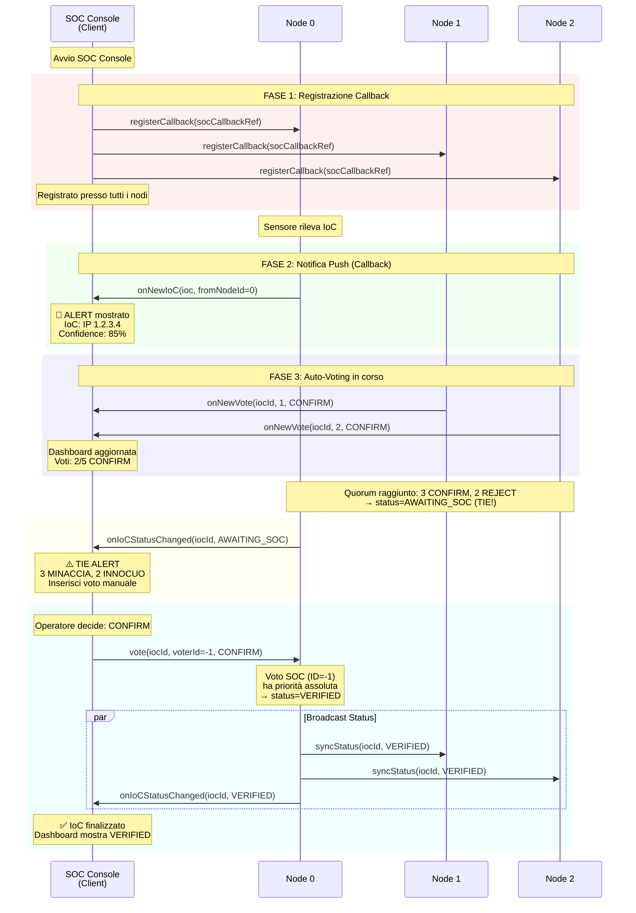
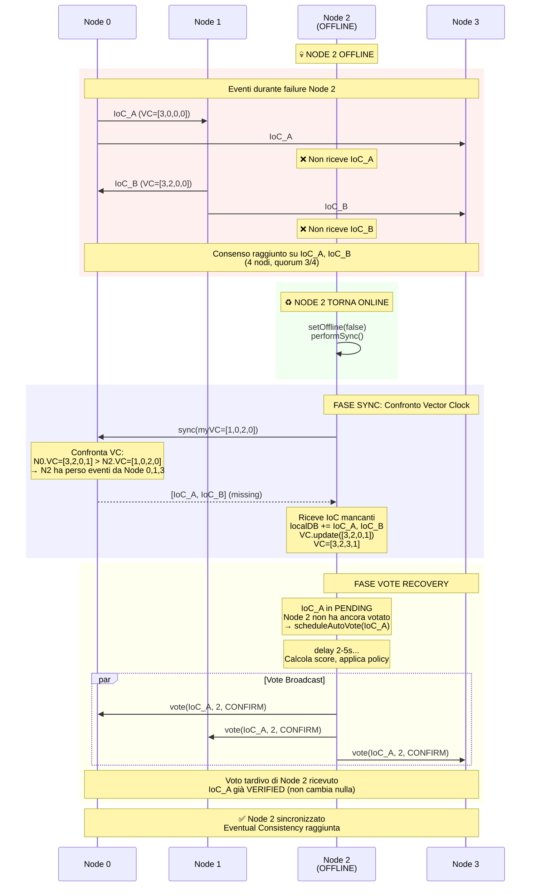

# Descrizione dei Protocolli - DTIP
## Diagrammi UML e Sequence Diagram

**Progetto per Esame di Algoritmi Distribuiti**
**Studente:** Francesco Caligiuri (Matricola 207688)
**Docente:** Prof. Giacomo Cabri
**Università degli Studi di Modena e Reggio Emilia**
**A.A. 2024/2025**

---

## Indice

1. [Architettura Client-Server vs Peer-to-Peer](#1-architettura-client-server-vs-peer-to-peer)
2. [Protocollo Gossip (Epidemic Broadcast)](#2-protocollo-gossip-epidemic-broadcast)
3. [Protocollo Vector Clock](#3-protocollo-vector-clock)
4. [Protocollo Ricart-Agrawala (Mutual Exclusion)](#4-protocollo-ricart-agrawala-mutual-exclusion)
5. [Protocollo Consenso Multi-tier](#5-protocollo-consenso-multi-tier)
6. [Interazione Client (SOC Console)](#6-interazione-client-soc-console)
7. [Protocollo Recovery e Sync](#7-protocollo-recovery-e-sync)

---

## 1. Architettura Client-Server vs Peer-to-Peer

### 1.1 Scelta Architetturale

DTIP implementa un'architettura **peer-to-peer pura** dove:
- **Ogni nodo è sia client che server**
- Non esiste un'autorità centrale
- Decisioni prese democraticamente
- Fault tolerance intrinseca (no single point of failure)

### 1.2 Diagramma Deployment - Topologia P2P



**Legenda:**
- **Linee solide ↔**: Connessioni RMI bidirezionali (peer-to-peer)
- **Linee tratteggiate -.->**: Registrazione RMI o Callback
- **Mesh completo**: Ogni nodo connesso a tutti gli altri (N-1 = 4 peer)

**Caratteristiche**:
- **5 nodi peer** con connessioni bidirezionali (mesh completo)
- **Ogni peer** espone `DTIPNodeInterface` via RMI
- **SOC Console** agisce come client osservatore (solo callback, no partecipazione al consenso core)
- **Dashboard Web** consuma REST API dai nodi (non rappresentata nel diagramma)

---

## 2. Protocollo Gossip (Epidemic Broadcast)

### 2.1 Descrizione Algoritmo

Il **Gossip Protocol** (o Epidemic Broadcast) è usato per propagare gli IoC a tutti i nodi della rete in modo decentralizzato e fault-tolerant.

**Proprietà**:
- **Complessità temporale**: O(log N) round per raggiungere tutti i nodi
- **Ridondanza**: Ogni nodo inoltra a più peer (fanout)
- **Fault tolerance**: Funziona anche con nodi offline (routing alternativo)
- **Deduplicazione**: Set `seenBy` previene loop infiniti

### 2.2 Parametri Configurabili

```java
FANOUT = 2-3;           // Numero di peer a cui inoltrare per round
GOSSIP_ROUNDS = 3;      // Numero di re-propagazioni per affidabilità
GOSSIP_DELAY = 0ms;     // No delay (propagazione immediata)
```

### 2.3 Sequence Diagram - Propagazione Gossip



### 2.4 Pseudocodice Gossip

```python
# PUBLISH (inizia gossip)
def publishIoC(ioc):
    vectorClock[myNodeId]++
    ioc.vectorClock = vectorClock.copy()
    ioc.seenBy.add(myNodeId)
    localDatabase[ioc.id] = ioc

    propagateIoC(ioc)

# RECEIVE (continua gossip)
def receiveIoC(ioc, fromNodeId):
    if ioc.id in localDatabase:
        return  # Già visto, ignora

    # Aggiorna Vector Clock
    for i in range(N):
        vectorClock[i] = max(vectorClock[i], ioc.vectorClock[i])
    vectorClock[myNodeId]++

    ioc.seenBy.add(myNodeId)
    localDatabase[ioc.id] = ioc

    propagateIoC(ioc)  # Continua propagazione

# PROPAGATE (logica gossip)
def propagateIoC(ioc):
    unseenPeers = [p for p in peers if p.id not in ioc.seenBy]

    # Seleziona fanout random peer
    targets = random.sample(unseenPeers, min(FANOUT, len(unseenPeers)))

    for peer in targets:
        async_send(peer.receiveIoC, ioc, myNodeId)
```

### 2.5 Analisi Complessità Gossip

**Tempo di Convergenza**:
- Con fanout F e N nodi: `T = O(log_F N)` round
- Per N=5, F=2: log₂(5) ≈ 2.32 round teorici
- **DTIP misurato**: 2-3 hop medi (conforme alla teoria)

**Messaggi Totali**:
- Caso peggiore (no deduplicazione): O(N²)
- Caso medio (con seenBy): O(N log N)
- **DTIP**: ~8-10 messaggi per IoC (N=5)

---

## 3. Protocollo Vector Clock

### 3.1 Descrizione Algoritmo

I **Vector Clocks** (Lamport 1978, Fidge/Mattern 1988) tracciano l'ordinamento causale degli eventi in un sistema distribuito.

**Proprietà Fondamentali**:
- Ogni processo mantiene un array `VC[N]` di contatori
- `VC[i]` = numero di eventi locali del processo `i`
- Permette di determinare relazione **happened-before** (`→`)

### 3.2 Regole Vector Clock

```java
// REGOLA 1: Evento locale o send
void tick() {
    clock[myNodeId]++;
}

// REGOLA 2: Ricezione messaggio
void update(int[] receivedClock) {
    for (int i = 0; i < N; i++) {
        clock[i] = max(clock[i], receivedClock[i]);
    }
    clock[myNodeId]++;  // Evento "receive" incrementa locale
}

// REGOLA 3: Confronto causale
int compareTo(VectorClock other) {
    boolean thisLess = false;
    boolean otherLess = false;

    for (int i = 0; i < N; i++) {
        if (this.clock[i] < other.clock[i]) thisLess = true;
        if (this.clock[i] > other.clock[i]) otherLess = true;
    }

    if (thisLess && !otherLess) return -1;  // this → other (happened-before)
    if (otherLess && !thisLess) return 1;   // other → this
    return 0;  // Concurrent (||)
}
```

### 3.3 Diagramma Eventi con Vector Clock

```
Time ───►

Node 0:  e₀[1,0,0]────────►e₁[2,0,0]──────────────►e₂[3,2,1]
                 \                               ╱
                  \      msg(VC=[2,0,0])        ╱
                   \                           ╱ msg(VC=[1,2,1])
Node 1:             \    e₃[0,1,0]──►e₄[2,2,0]
                     \              ╱        \
                      \            ╱          \
Node 2:                ▼          ╱            ▼
                    e₅[2,0,1]────┘          e₆[2,2,1]


Relazioni Causali:
  e₀ → e₅  (Node 0 invia a Node 2)
  e₅ → e₄  (Node 2 invia a Node 1)
  e₄ → e₂  (Node 1 invia a Node 0)

  e₀ → e₄ (transitività: e₀ → e₅ → e₄)

  e₁ || e₃ (concorrenti: nessun nodo ha VC[i] ≥ altro per tutti i)
```

### 3.4 Utilizzo in DTIP

**Caso d'uso**: Tracciare ordine di pubblicazione IoC

```
Scenario: Node 0 pubblica IoC_A, Node 1 pubblica IoC_B

1. Node 0 pubblica IoC_A:
   VC_A = [1,0,0,0,0,0]

2. Node 1 pubblica IoC_B (prima di ricevere IoC_A):
   VC_B = [0,1,0,0,0,0]

3. Node 2 riceve IoC_A:
   VC_Node2 = max([0,0,0,0,0,0], [1,0,0,0,0,0]) = [1,0,0,0,0,0]
   VC_Node2[2]++ = [1,0,1,0,0,0]

4. Node 2 riceve IoC_B:
   VC_Node2 = max([1,0,1,0,0,0], [0,1,0,0,0,0]) = [1,1,1,0,0,0]
   VC_Node2[2]++ = [1,1,2,0,0,0]

Analisi:
  VC_A = [1,0,0,0,0,0]
  VC_B = [0,1,0,0,0,0]

  Confronto: VC_A[0]=1 > VC_B[0]=0  E  VC_A[1]=0 < VC_B[1]=1
  → CONCORRENTI (||)

  ✅ Node 2 può processare IoC_A e IoC_B in qualsiasi ordine
```

### 3.5 Sequence Diagram - Vector Clock Update



---

## 4. Protocollo Ricart-Agrawala (Mutual Exclusion)

### 4.1 Descrizione Algoritmo

**Ricart-Agrawala (1981)** è un algoritmo di mutua esclusione distribuita basato su permission.

**Proprietà**:
- **Safety**: Al massimo 1 processo in Critical Section
- **Liveness**: Ogni richiesta viene eventualmente soddisfatta
- **Fairness**: Ordine FIFO basato su timestamp (sequence number)
- **Message Complexity**: 2(N-1) messaggi per CS entry

### 4.2 Stati del Protocollo



**Transizioni**:
- **IDLE → WAITING**: Nodo richiede accesso a Critical Section
- **WAITING → IN_CS**: Ricevute tutte le N-1 REPLY (permission granted)
- **WAITING → IDLE**: Timeout scatta dopo 5s (evita deadlock)
- **IN_CS → IDLE**: Nodo esce da CS e invia tutte le REPLY differite

**Variabili di Stato**:
- `requesting`: true se sto richiedendo CS
- `inCriticalSection`: true se sono in CS
- `mySequenceNumber`: timestamp logico per priorità
- `outstandingReplies`: contatore di REPLY ancora da ricevere
- `deferredReplies`: lista di nodi a cui devo inviare REPLY differita

### 4.3 Sequence Diagram - Caso Singola Richiesta



### 4.4 Sequence Diagram - Richieste Concorrenti



### 4.5 Pseudocodice Ricart-Agrawala

```python
# STATO
requesting = False
inCriticalSection = False
mySequenceNumber = 0
highestSequenceNumberSeen = 0
outstandingReplies = 0
deferredReplies = []

# REQUEST MUTEX
def requestMutex():
    requesting = True
    mySequenceNumber = highestSequenceNumberSeen + 1
    outstandingReplies = N - 1  # Attendo reply da tutti i peer

    broadcast_to_all_peers(REQUEST, myNodeId, mySequenceNumber)

    wait_until(outstandingReplies == 0, timeout=5s)

    if timeout:
        abort_request()  # Deadlock prevention
        return

    inCriticalSection = True
    # Ora posso entrare in CS

# RECEIVE REQUEST
def onReceiveRequest(requesterId, sequenceNumber):
    highestSequenceNumberSeen = max(highestSequenceNumberSeen, sequenceNumber)

    defer = False

    if requesting:
        # Priorità: sequence number minore vince
        # Pareggio: node ID minore vince
        myPriority = (mySequenceNumber < sequenceNumber) or \
                     (mySequenceNumber == sequenceNumber and myNodeId < requesterId)

        if myPriority:
            defer = True

    if defer:
        deferredReplies.append(requesterId)
    else:
        send(requesterId, REPLY)

# RECEIVE REPLY
def onReceiveReply(replierId):
    outstandingReplies -= 1
    if outstandingReplies == 0:
        notify_waiting_thread()

# RELEASE MUTEX
def releaseMutex():
    inCriticalSection = False
    requesting = False

    for nodeId in deferredReplies:
        send(nodeId, REPLY)

    deferredReplies.clear()
```

### 4.6 Timeout e Deadlock Prevention

**Problema**: Se un nodo crasha mentre altri attendono la sua REPLY, sistema in deadlock.

**Soluzione**: Timeout di 5 secondi su wait

```java
while (outstandingReplies > 0) {
    long remaining = deadline - System.currentTimeMillis();
    if (remaining <= 0) {
        // TIMEOUT! Abortisci richiesta
        requesting = false;
        outstandingReplies = 0;
        return; // Non entro in CS
    }
    lock.wait(remaining);
}
```

**Comportamento**:
- Se timeout scatta → richiesta abortita
- Nodo può riprovare successivamente
- Sistema non si blocca indefinitamente

---

## 5. Protocollo Consenso Multi-tier

### 5.1 Descrizione Protocollo

DTIP implementa un protocollo di **consenso distribuito eterogeneo** dove ogni nodo ha una **policy di voto diversa**.

**Innovazione vs Paxos/Raft**:
- Paxos/Raft assumono repliche identiche
- DTIP abbraccia **policy diversity** (ogni organizzazione ha tolleranza al rischio diversa)

### 5.2 Fasi del Consenso

```
FASE 1: GOSSIP
  ├─► IoC propagato a tutti i nodi (O(log N) round)
  └─► Tutti i nodi hanno l'IoC in stato PENDING

FASE 2: AUTO-VOTING (2-5s delay per nodo)
  ├─► Ogni nodo calcola threat score locale
  ├─► Applica la propria policy (CONSERVATIVE/AGGRESSIVE/etc.)
  └─► Vota CONFIRM o REJECT

FASE 3: VOTE PROPAGATION
  ├─► Ogni voto è broadcast a tutti i peer
  └─► Ogni nodo aggiorna voteMap locale

FASE 4: QUORUM CHECK
  ├─► Quando ricevuti (N/2)+1 voti (quorum = 4 per N=6)
  ├─► Conta CONFIRM vs REJECT
  └─► Determina stato finale:
        • VERIFIED (CONFIRM > REJECT)
        • REJECTED (REJECT > CONFIRM)
        • AWAITING_SOC (CONFIRM == REJECT)

FASE 5: FINALIZATION
  ├─► Primo nodo che rileva stato finale → broadcast syncStatus()
  ├─► Tutti i nodi convergono allo stato finale
  └─► Se VERIFIED → mutex + scrittura ledger
```

### 5.3 Sequence Diagram - Consenso Completo



### 5.4 Tabella Decision - Regole Quorum

| Voti CONFIRM | Voti REJECT | Quorum ((N/2)+1) | Stato Finale | Note |
|--------------|-------------|--------------|--------------|------|
| 5 | 0 | 3/5 ✅ | **VERIFIED** | Unanimità |
| 4 | 1 | 3/5 ✅ | **VERIFIED** | Maggioranza chiara |
| 3 | 2 | 3/5 ✅ | **VERIFIED** | Maggioranza semplice |
| 2 | 3 | 3/5 ✅ | **REJECTED** | Maggioranza REJECT |
| 1 | 4 | 3/5 ✅ | **REJECTED** | Maggioranza chiara |
| 0 | 5 | 3/5 ✅ | **REJECTED** | Unanimità negativa |
| - | - | 3/5 ⚠️ | **AWAITING_SOC** | Pareggio impossibile con 5 nodi (dispari) |
| 2 | 2 | 3/5 ⏳ | **PENDING** | Quorum non raggiunto (4 voti totali) |

**Note sul Quorum**:
- **Quorum Size**: (N/2) + 1 = 3 voti (tutti i nodi votano, incluso il publisher)
- **Tie-breaking**: Con 5 nodi (dispari), il pareggio non può avvenire se tutti votano. Se un nodo è offline (es. 2 vs 2), si attende il 5° voto o l'intervento SOC.
- **Decisione**: Maggioranza semplice (CONFIRM > REJECT o viceversa)

### 5.5 Policy Eterogenee - Codice

```java
private IoC.VoteType computeLocalVote(IoC ioc) {
    int baseScore = computeThreatScore(ioc); // API + heuristics

    // Node-specific voting policies
    switch (nodeId) {
        case 0: // Banca - CONSERVATIVE
            return baseScore >= 70 ? CONFIRM : REJECT;

        case 1: // Retail - AGGRESSIVE
            return baseScore >= 30 ? CONFIRM : REJECT;

        case 2: // Energia - BALANCED
            return baseScore >= 50 ? CONFIRM : REJECT;

        case 3: // Sanità - PARANOID (better safe than sorry)
            return baseScore >= 10 ? CONFIRM : REJECT;

        case 4: // Trasporti - SKEPTICAL
            return baseScore >= 80 ? CONFIRM : REJECT;

        case 5: // PA - RANDOM (simula unreliable analysis)
            return random() ? CONFIRM : REJECT;

        default:
            return baseScore >= 50 ? CONFIRM : REJECT;
    }
}
```

**Vantaggi Policy Diversity**:
- Riflette realtà organizzative (banche conservative, ospedali paranoid)
- Previene groupthink (un nodo non influenza tutti)
- Robustezza contro nodi malevoli (1 nodo corrotto non decide da solo)

---

## 6. Interazione Client (SOC Console)

### 6.1 Architettura Client-Server (Componente Hybrid)

DTIP è **P2P per i nodi core**, ma include un **client osservatore** (SOC Console) che interagisce tramite:
- **RMI Callbacks** per notifiche real-time
- **Metodi RMI** per comandi (voto manuale, query)

### 6.2 Sequence Diagram - SOC Console Interaction



### 6.3 RMI Callback Interface

```java
public interface DTIPCallbackInterface extends Remote {
    // Notifica nuovo IoC
    void onNewIoC(IoC ioc, int fromNodeId) throws RemoteException;

    // Notifica nuovo voto
    void onNewVote(String iocId, int voterId, IoC.VoteType vote) throws RemoteException;

    // Notifica cambio stato IoC
    void onIoCStatusChanged(String iocId, IoC.IoCStatus newStatus) throws RemoteException;

    // Notifica cambio reputation
    void onReputationChanged(int nodeId, double newScore) throws RemoteException;
}
```

**Vantaggi Push Model (Callback)**:
- Latenza ridotta (no polling)
- Event-driven architecture
- Scalabile (client non interroga continuamente)

---

## 7. Protocollo Recovery e Sync

### 7.1 Descrizione Problema

Quando un nodo va offline e ritorna online, deve:
1. **Scoprire** quali IoC/eventi ha perso
2. **Scaricare** i dati mancanti dai peer
3. **Convergere** allo stato globale (eventual consistency)

### 7.2 Algoritmo Anti-Entropy Sync

```python
def performSync():
    myVC = vectorClock.getClock()

    for peer in peers:
        try:
            # Richiedi IoC mancanti confrontando Vector Clocks
            missingIoCs = peer.sync(myVC)

            for ioc in missingIoCs:
                if ioc.id not in localDatabase:
                    # Aggiungi IoC mancante
                    localDatabase[ioc.id] = ioc

                    # Aggiorna Vector Clock
                    vectorClock.update(ioc.vectorClock)

            # Vota su IoC in PENDING senza mio voto
            for ioc in localDatabase.values():
                if ioc.status == PENDING and myNodeId not in ioc.votes:
                    scheduleAutoVote(ioc)

        except RemoteException:
            # Peer offline, prova con altri
            continue
```

### 7.3 Sequence Diagram - Recovery dopo Failure



### 7.4 Proprietà Sync Protocol

**Eventual Consistency**:
- Garantita dal confronto Vector Clock
- Ogni nodo interroga tutti i peer (ridondanza)
- Convergenza in tempo finito (assumendo rete affidabile)

**Complessità**:
- **Tempo**: O(1) round (sync request sincrono)
- **Messaggi**: O(N) richieste sync (1 per peer)
- **Dati trasferiti**: O(M) dove M = IoC mancanti (tipicamente pochi)

**Ottimizzazione**:
- **Vector Clock pruning**: Confronto elemento per elemento (evita inviare tutti gli IoC)
- **Deduplicazione**: Controllo `ioc.id in localDB` prima di aggiungere

---

## 8. Diagramma Classi UML Completo

```mermaid
classDiagram
    %% Interfacce RMI
    class DTIPNodeInterface {
        <<interface>>
        +publishIoC(IoC) String
        +receiveIoC(IoC, int) void
        +vote(String, int, VoteType) void
        +receiveVote(String, int, VoteType) void
        +receiveMutexRequest(int, int, int) void
        +receiveMutexReply(int) void
        +registerCallback(DTIPCallbackInterface) void
        +getAllIoCs() List~IoC~
        +getVectorClock() int[]
        +sync(int[]) List~IoC~
        +setOffline(boolean) void
    }

    class DTIPCallbackInterface {
        <<interface>>
        +onNewIoC(IoC, int) void
        +onNewVote(String, int, VoteType) void
        +onIoCStatusChanged(String, IoCStatus) void
        +onReputationChanged(int, double) void
    }

    %% Classi Core
    class DTIPNode {
        -int nodeId
        -String nodeName
        -Map~String,IoC~ iocDatabase
        -VectorClock vectorClock
        -RicartAgrawalaManager mutexManager
        -Map~Integer,DTIPNodeInterface~ peers
        -List~DTIPCallbackInterface~ callbacks
        -Map~Integer,NodeReputation~ reputations
        -boolean isOffline
        +publishIoC(IoC) String
        +receiveIoC(IoC, int) void
        -propagateIoC(IoC) void
        -scheduleAutoVote(IoC) void
        -computeLocalVote(IoC) VoteType
        +requestCriticalSection() void
        +releaseCriticalSection() void
        +performSync() void
    }

    class VectorClock {
        -int[] clock
        -int nodeId
        -int numNodes
        +tick() void
        +update(int[]) void
        +compareTo(VectorClock) int
        +getClock() int[]
        +happenedBefore(VectorClock) boolean
    }

    class RicartAgrawalaManager {
        -int myNodeId
        -int mySequenceNumber
        -int highestSequenceNumberSeen
        -boolean requesting
        -boolean inCriticalSection
        -int outstandingReplies
        -List~Integer~ deferredReplies
        +requestMutex() void
        +releaseMutex() void
        +handleRequest(int, int, int) void
        +handleReply(int) void
        +getState() MutexState
    }

    %% Model Classes
    class IoC {
        -String id
        -IoCType type
        -String value
        -int confidence
        -List~String~ tags
        -int publisherId
        -String publisherName
        -long publishedAt
        -int[] vectorClock
        -Set~Integer~ seenBy
        -Map~Integer,VoteType~ votes
        -IoCStatus status
        -int quorumSize
        +addVote(int, VoteType) void
        -updateStatus() void
        +getStatus() IoCStatus
    }

    class NodeReputation {
        -int nodeId
        -String nodeName
        -int iocPublished
        -int iocVerified
        -int iocRejected
        -int correctVotes
        -int incorrectVotes
        -double accuracyRate
        +onIoCVerified() void
        +onIoCRejected() void
        +onCorrectVote() void
        +onIncorrectVote() void
        +getAccuracyRate() double
    }

    class NodeInfo {
        -int nodeId
        -String nodeName
        -int iocCount
        -int peerCount
    }

    class MutexState {
        -boolean requesting
        -int mySequenceNumber
        -List~Integer~ deferredReplies
        -int outstandingReplies
    }

    class NodeEvent {
        -long timestamp
        -String type
        -String detail
        -String iocId
    }

    %% Client Classes
    class SOCConsole {
        -IoC currentIoC
        -Set~String~ seenIoCIds
        -List~DTIPNodeInterface~ nodes
        +onNewIoC(IoC, int) void
        +onNewVote(String, int, VoteType) void
        +onIoCStatusChanged(String, IoCStatus) void
        +voteAll(String, VoteType) void
        +listIoCs() void
    }

    %% Enums
    class IoCType {
        <<enumeration>>
        IP
        DOMAIN
        HASH
        URL
        EMAIL
        CVE
    }

    class IoCStatus {
        <<enumeration>>
        PENDING
        VERIFIED
        REJECTED
        AWAITING_SOC
        EXPIRED
    }

    class VoteType {
        <<enumeration>>
        CONFIRM
        REJECT
    }

    %% Relationships - Implements
    DTIPNode ..|> DTIPNodeInterface : implements
    SOCConsole ..|> DTIPCallbackInterface : implements

    %% Relationships - Composition (has-a)
    DTIPNode *-- VectorClock : has
    DTIPNode *-- RicartAgrawalaManager : has
    DTIPNode "1" *-- "0..*" IoC : stores
    DTIPNode "1" *-- "0..*" NodeReputation : maintains
    DTIPNode "1" o-- "0..*" DTIPNodeInterface : peers
    DTIPNode "1" o-- "0..*" DTIPCallbackInterface : callbacks

    %% Relationships - Associations
    IoC --> IoCType : type
    IoC --> IoCStatus : status
    IoC --> VoteType : votes

    %% Utility relationships
    RicartAgrawalaManager ..> MutexState : returns
    DTIPNode ..> NodeEvent : logs
    DTIPNode ..> NodeInfo : returns
```



**Legenda Relazioni**:
- **─────|>** : Implements (interface)
- **───────** : Association
- **◆─────** : Composition (strong ownership)
- **◇─────** : Aggregation (weak ownership)
- **- - - -** : Dependency

**Package Organization**:
- `core.*`: DTIPNode, VectorClock, RicartAgrawalaManager, SensorListener
- `model.*`: IoC, NodeReputation, NodeInfo, MutexState, NodeEvent
- `interfaces.*`: DTIPNodeInterface, DTIPCallbackInterface
- `util.*`: ConsoleColors, ThreatIntelAPI, MetricsCollector
- `client.*`: SOCConsole, AttackSimulator, WebBridge

**Key Design Patterns**:
- **Observer Pattern**: DTIPCallbackInterface per notifiche real-time
- **Singleton**: MetricsCollector per metriche globali
- **Strategy Pattern**: computeLocalVote() implementa diverse policy per nodo


---

## 9. Considerazioni Finali

### 9.1 Scelta P2P vs Client-Server

**Perché P2P?**
- ✅ **No single point of failure** (centrale down → sistema continua)
- ✅ **Scalabilità orizzontale** (aggiungi nodi senza collo di bottiglia)
- ✅ **Autonomia** (ogni organizzazione mantiene controllo sui propri dati)
- ✅ **Fault tolerance** (quorum funziona con nodi offline)

**Trade-offs**:
- ❌ Complessità implementativa maggiore
- ❌ Overhead di coordinazione (O(N²) connessioni per mesh completo)
- ❌ Consenso più lento rispetto a decisione centralizzata

### 9.2 Complessità Algoritmi

| Algoritmo | Complessità Messaggi | Complessità Tempo | Complessità Spazio |
|-----------|---------------------|-------------------|-------------------|
| **Gossip** | O(N log N) | O(log N) round | O(N) per IoC |
| **Vector Clock** | O(N) per messaggio | O(N) confronto | O(N) per nodo |
| **Ricart-Agrawala** | 2(N-1) per CS | O(1) (wait asincrona) | O(N) deferred |
| **Consenso DTIP** | O(N²) (broadcast voti) | O(1) (voto locale) | O(N) voteMap |

### 9.3 Conformità Teoria

DTIP implementa fedelmente gli algoritmi del corso:

1. **Vector Clocks**: Regole tick/update conformi a Lamport 1978, Fidge 1988
2. **Ricart-Agrawala**: Implementazione completa con priorità, deferred replies, timeout
3. **Gossip**: Fanout, re-gossip, deduplicazione (Birman 1999)
4. **Consenso**: Variante originale con policy eterogenee (innovazione sul tema)

---

**Fine Documento Protocolli UML**
Versione 1.0 - 06 Gennaio 2025
